```@meta
EditURL = "<unknown>/intro.jl"
```

# 生物資訊基礎教學系列：Julia程式語言基礎
#### Date: 2020-06-28
#### Speaker：米夏糯

---

## 本日介紹內容包含了
+ 學習程式語言的目的及意義
+ Julia程式語言簡介
+ Julia程式語言基礎
+ 學完基礎語法之後

---

# 學習程式語言的目的及意義
## 學了程式語言能做些什麼事情


---

# 學習程式語言的目的及意義
## __沒有!__

>> 寫程式絕對是適合男女老幼的，「寫程式的都是肥宅」只是大家對它的誤解。寫程式更加是一種藝術，一種無中生有的精神。

---

## 初學程式語言時所需要具備的心態: __Grit__


---

# Julia程式語言簡介
## Julia程式語言的發展脈絡
+ 想要開源的語言、自由的版權、C語言的速度、如Lisp一般的一致性、支援像Matlab一樣的數學符號、如Python一般的通用、處理統計能像R一樣簡單、處理字串如Perl般的自然，同時能像shell一樣串接程式。
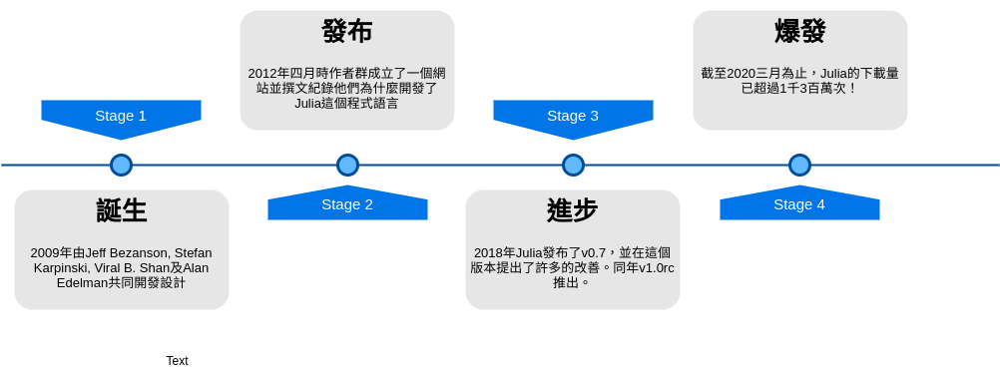

---

## Julia語言的特性 (1/3)
+ Write like Python, run like C
+ 高效的運算速度
+ 直接簡單的語法
+ 同時支援動態、靜態類型
+ 支援多種程式設計風格

---

## Julia語言的特性 (2/3)
#### Benchmark
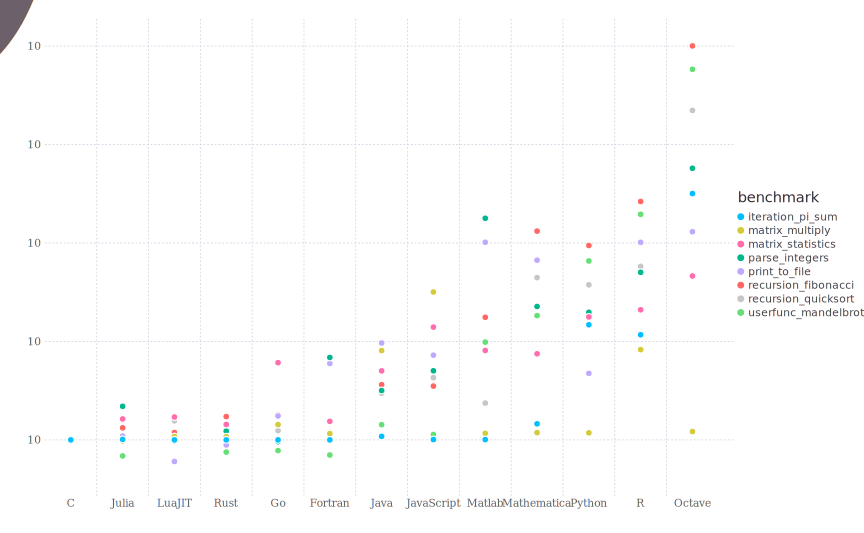

---

## Julia語言的特性 (3/3)
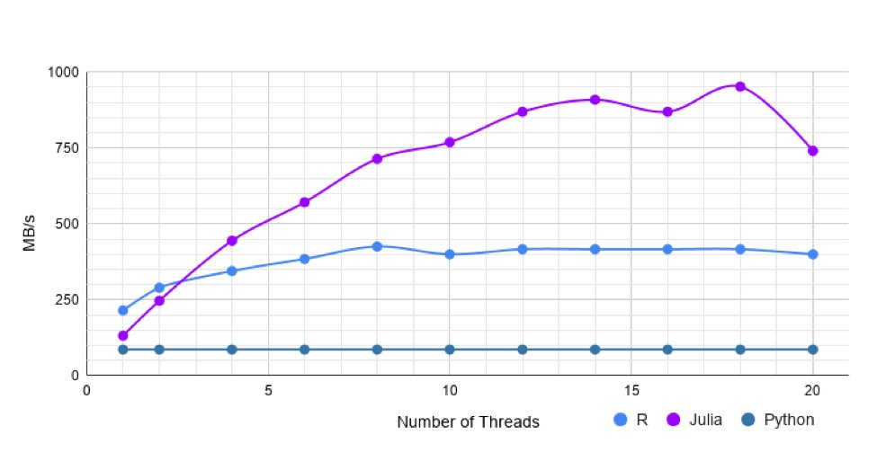

---

## 學習Julia語言的管道途徑以及學習資源 (1/2)
+ 書籍
  - [Julia 程式設計：新世代資料科學與數值運算語言](https://www.tenlong.com.tw/products/9789577633828?list_name=srh)
  - [Python 接班人出世：最新科學專用語言 Julia 入門實戰](https://www.tenlong.com.tw/products/9789865501006?list_name=srh)
+ 影片
  - [Julia Taiwan Meetup](https://www.youtube.com/channel/UCHS7SCM_GDDMreNQfW5LFzQ/videos)
  - [阿杜的YouTube頻道](https://www.youtube.com/c/%E6%9D%9C%E5%B2%B3%E8%8F%AF/videos)
+ 線上課程
  - [Julia Academy](https://juliaacademy.com/)
  - [Udemy](https://www.udemy.com/topic/julia-programming-language/)

---

## 學習Julia語言的管道途徑以及學習資源 (2/2)
+ [Julia Taiwan社群所翻譯之文件](https://hackmd.io/@7WeiUEuJSBKp7WCRouAWVg/r106dSpkb/%2FKwBhCMBYA4GYE4C0B2e4BsiYEYCGjwAmZaRbddbcEbSEeAExCA%3D%3D?type=book)
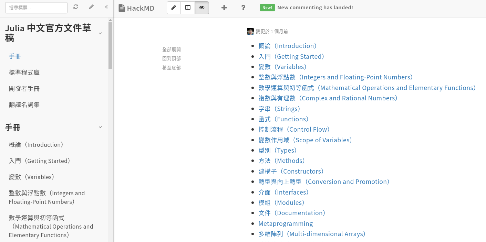

---

# Julia程式語言基礎
## 安裝Julia (1/5)
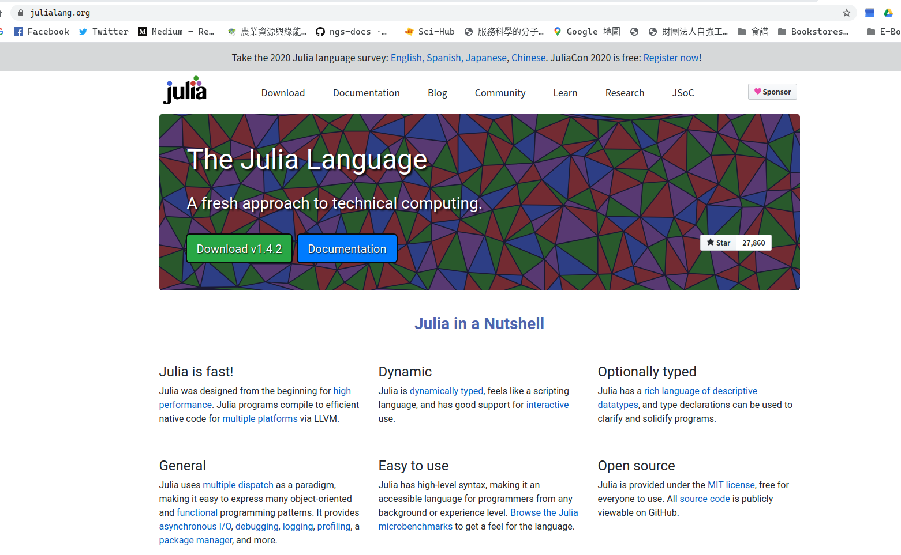

---

## 安裝Julia (2/5)
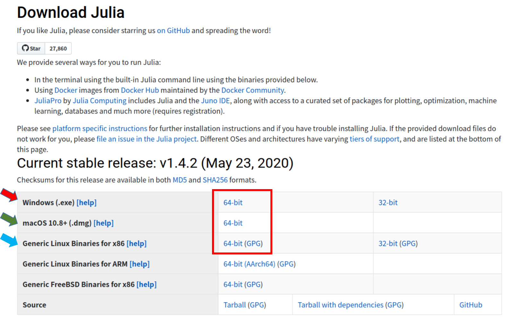

---

## 安裝Julia (3/5)
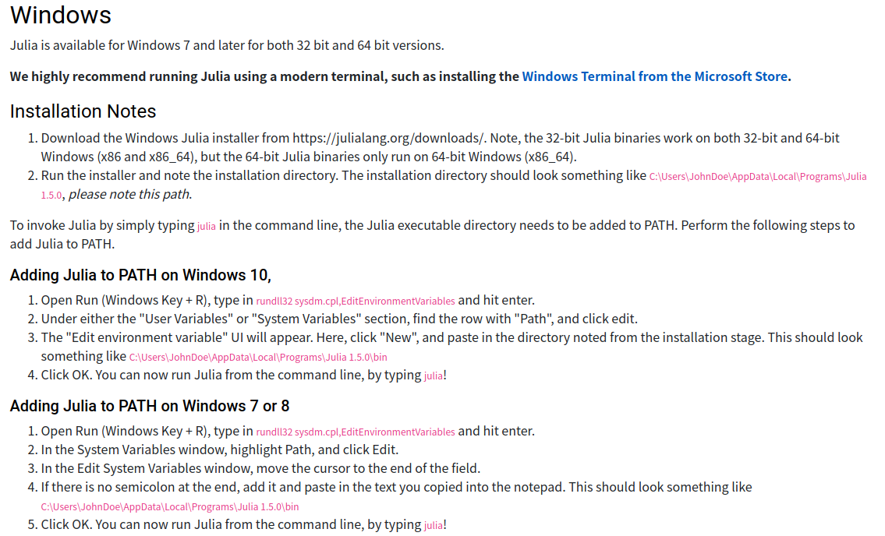

---

## 安裝Julia (4/5)
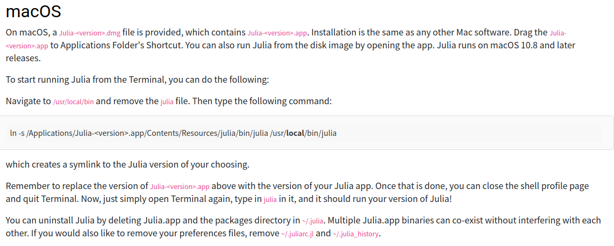

---

## 安裝Julia (5/5)
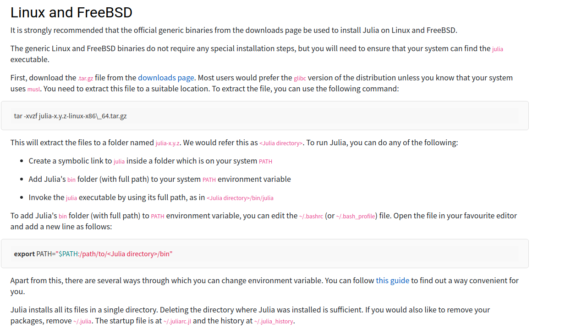

---

## 撰寫Julia時使用的工具平台 - VS Code (1/6)


---

## 撰寫Julia時使用的工具平台 - VS Code (2/6)
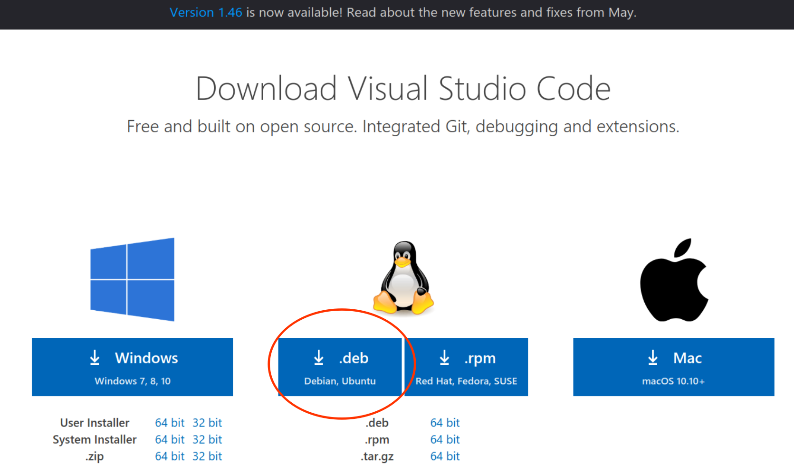

---

## 撰寫Julia時使用的工具平台 - VS Code (3/6)
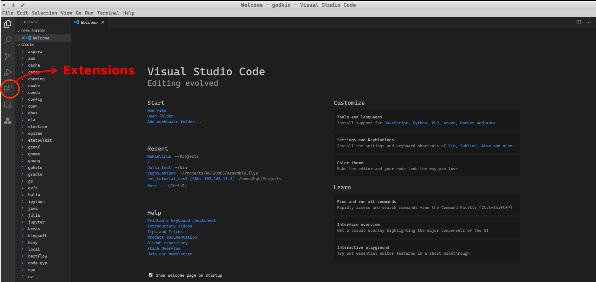

---img/

## 撰寫Julia時使用的工具平台 - VS Code (4/6)
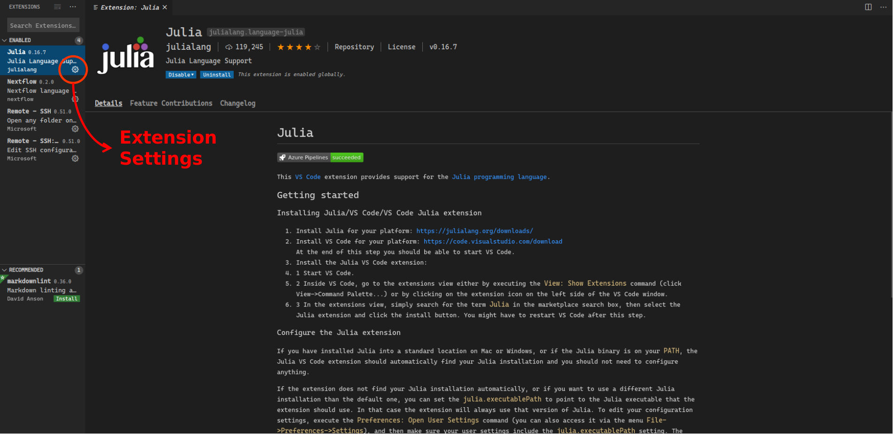

---

## 撰寫Julia時使用的工具平台 - VS Code (5/6)
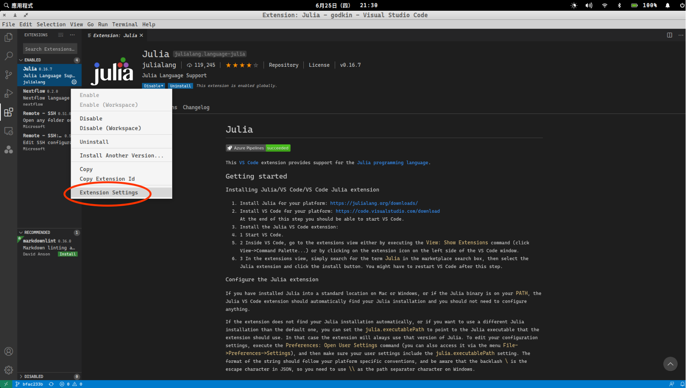

---

## 撰寫Julia時使用的工具平台 - VS Code (6/6)
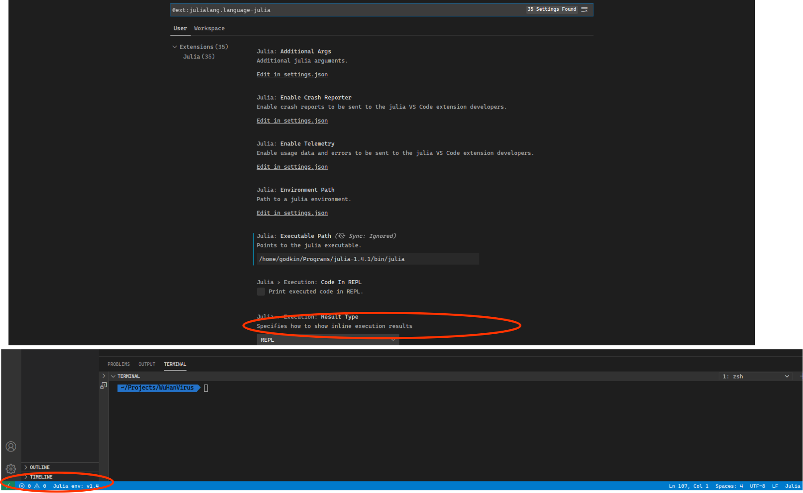

---

## 撰寫Julia時使用的工具平台 - Jupyter Notebook (1/6)
+ 安裝IJulia
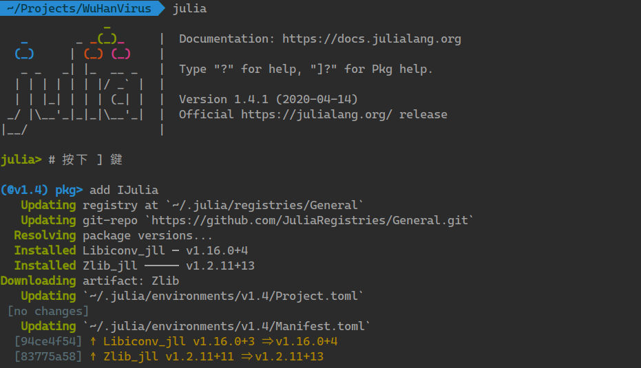

---

## 撰寫Julia時使用的工具平台 - Jupyter Notebook (2/6)
+ 安裝Anaconda (1/2)


---

## 撰寫Julia時使用的工具平台 - Jupyter Notebook (3/6)
+ 安裝Anaconda (2/2)
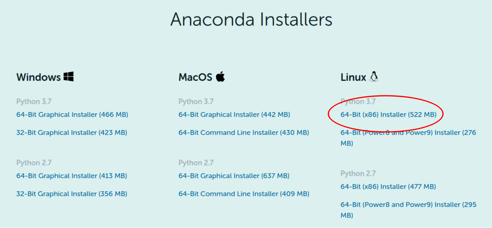

---

## 撰寫Julia時使用的工具平台 - Jupyter Notebook (4/6)
+ 安裝Jupyter Notebook (1/3)
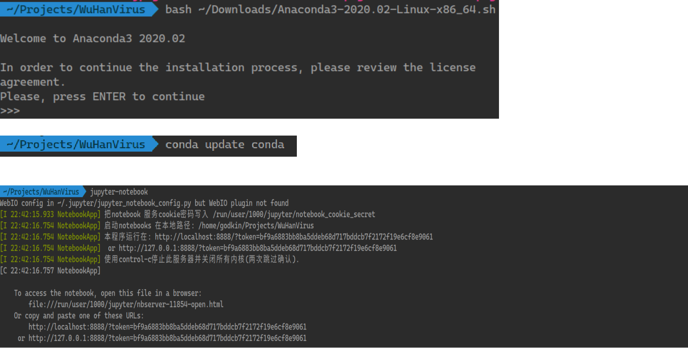

---

## 撰寫Julia時使用的工具平台 - Jupyter Notebook (5/6)
+ 安裝Jupyter Notebook (2/3)
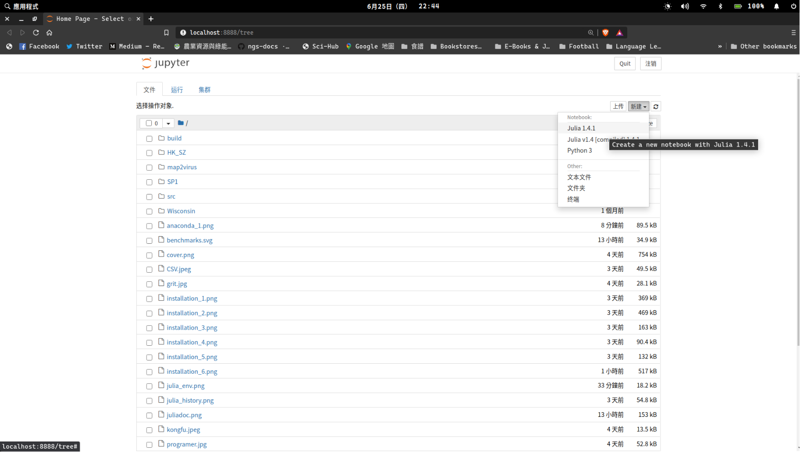

---

## 撰寫Julia時使用的工具平台 - Jupyter Notebook (6/6)
+ 安裝Jupyter Notebook (3/3)
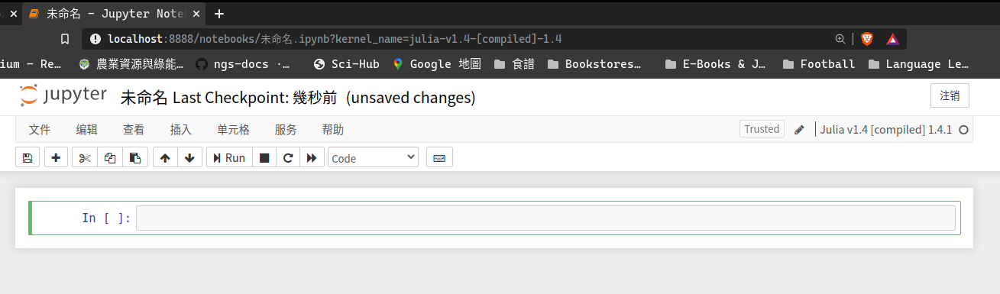

---

## 基礎語法與概念 - 寫出你的第一支hello world

+ 進入Julia環境
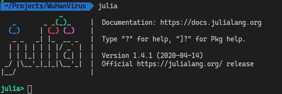

+ 輸入以下程式碼，並按Enter送出

```@example intro
println("Hello world")
```

---

## 基礎語法與概念 - 註解

+ 單行註解

```@example intro
# 井字號開頭的是註解
println("上面是註解")
```

+ 多行註解

```@example intro
#=
如果想要使用多行註解,
可以用#=及=#夾住所需要註解的內容
=#
```

---

## 基礎語法與概念 - 變數 (1/4)
> 在Julia裡頭，一個變數是指與一個值所存在的記憶體空間__有關__（或稱為__綁定__）的一個名字。當我們想在後續使用目前運算後所得到的值，透過變數存取就會比直接對記憶體位置存取來的簡單易懂。


```@example intro
# 將5這個值指定到一個名為x的變數, 這邊的=所表示的是"指派"的意思而非"等於"
# 這個過程我們也稱之為"宣告"
x = 5
# 輸入變數名稱x, 我們就可以獲得這個變數所存取之值的內容
x
```

---

## 基礎語法與概念 - 變數 (2/4)

```@example intro
# 將前一張投影片中所宣告的變數x加上6後所得運算結果重新指派給x這個變數
x = x + 6
# 此時x的值就會等於11
x
```

---

## 基礎語法與概念 - 變數 (3/4)
#### 變數命名規則
+ 開頭僅能使用字母(A-Z, a-z)、底線或是__Unicode__(須大於00A0)的字元
  - _123 (valid)
  - Abcd (valid)
  - 5566 (invalid)
  - δ (valid)
+ 不能使用保留字作為變數名稱
  - if
  - while
  - local
  - end
  - true

---

## 基礎語法與概念 - 變數 (4/4)
#### 支援[Unicode](https://docs.julialang.org/en/v1/manual/unicode-input/) & LaTex語法作為變數名稱

+ Example 1:

```@example intro
# 輸入\delta 再按tab鍵，就會產生一個希臘字母 δ
# 宣告一個名為α₂的變數，並綁定到0.23這個值
α₂ = 0.23
```

+ Example 2:

```@example intro
🌱 = 0
🚰 = 5
🌅 = 5
🌳 =  🌱 + 🚰 + 🌅
```

---

## 基礎語法與概念 - 加減乘除
+ 加

```@example intro
2 + 5
```

+ 減

```@example intro
2 - 5
```

+ 乘

```@example intro
3 * 8
```

+ 除

```@example intro
8 / 3
```

---

## 基礎語法與概念 - 浮點數
> 有小數點的數字在程式語言中就被稱為__浮點數__
+ 純整數相加

```@example intro
5 + 5
```

+ 浮點數相加

```@example intro
5.0 + 5
```

---

## 基礎語法與概念 - 型別
+ 使用`typeof()`來檢查型別

```@example intro
typeof(5)
```

+ 檢查浮點數

```@example intro
typeof(5.0)
```

+ 在Julia裡頭使用到的型別主要有：
  - Int (Int8, Int16, Int32, Int64, UInt etc.)
  - Float (Float16, Float32, Float64 etc.)
  - Char
  - String
  - Boolean

---

## 基礎語法與概念 - 數字與運算子 (1/4)
#### 整數 (1/2)
> 如果沒有特別宣告，會依系統位元數決定
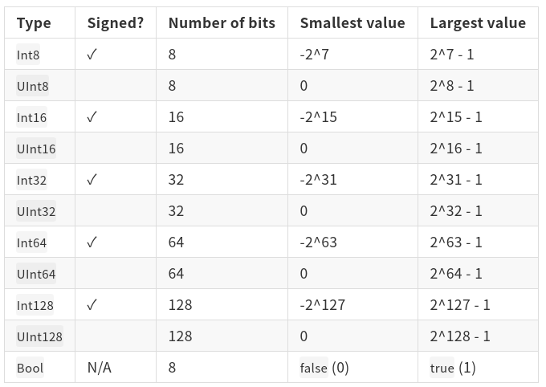

---

## 基礎語法與概念 - 數字與運算子 (1/4)
#### 整數 (2/2)
+ 宣告非預設型別的整數

```@example intro
Int8(10)
typeof(ans)
```

+ 取得不同位元數的上下限

```@example intro
typemax(Int8) # 取得上限
typemin(Int8) # 取得下限
```

+ 溢位

```@example intro
typemax(Int8) + Int8(1)
```

---

## 基礎語法與概念 - 數字與運算子 (2/4)
#### 浮點數
+ 含小數點浮點數
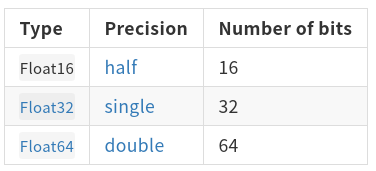
+ 特殊浮點數
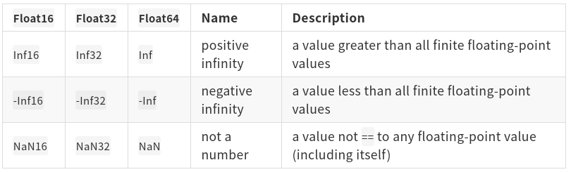

---

## 基礎語法與概念 - 數字與運算子 (3/4)
#### 常數及係數
+ 預設常數

```@example intro
pi
```

+ 宣告常數

```@example intro
const C = 1.23456
```

+ 字面係數

```@example intro
x = 3
2x^2 - 3x + 1
```

---

## 基礎語法與概念 - 數字與運算子 (4/4)
#### 運算子 (1/3)
+ 算術運算子

```@example intro
# -x: 變號
# x + y, x - y, x * y, x / y: 四則運算
# div(x,y): 求商
# x % y: 求餘
# x \ y: 與 x / y 相同
# x ^ y: 次方
```

+ 比較運算子

```@example intro
# x == y: 等於
# x != y, x ≠ y: 不等於
# x < y: 小於
# x > y: 大於
# x <= y, x ≤ y: 小於等於
# y >=, x ≥ y: 大於等於
```

---

## 基礎語法與概念 - 數字與運算子 (4/4)
#### 運算子 (2/3)

```@example intro
# 1.更新運算子
# 舊寫法

x = 5
y = 0
y = y + 2x
# 使用更新運算子的寫法
y += 2x
# 其他更新運算子：-=, *=, /=, %=等

# 2. 布林運算子
# x = true; typeof(x)
# !x, ~x: 非 (negation)
# x & y: 且
# x | y: 或
```

---

## 基礎語法與概念 - 控制流程 (1/3)

#### if 條件判斷 (1/2)
+ if條件判斷語法結構：

```@example intro
# if <判斷式>
#    <運算式>
# end

x = 0
y = 5
if x < y
    println("x is less than y")
end
```

---

## 基礎語法與概念 - 控制流程 (1/3)

#### if 條件判斷 (2/2)
+ if-else條件判斷語法結構：

```@example intro
# if <判斷式>
#    <運算式-1>
# else
#    <運算式-2>
# end
```

+ if-elseif-else條件判斷語法結構：

```@example intro
# if <判斷式-1>
#    <運算式-1>
# elseif <判斷式-2>
#    <運算式-2>
# else
#    <運算式-3>
# end
```

---

## 基礎語法與概念 - 控制流程 (2/3)

#### for 迴圈 (1/2)
+ for迴圈語法結構：

```@example intro
# for i = <起始>:<結束>
#     <運算式程式碼區塊>
# end

a = 0
for i = 1:100
    global a
    a += i
end
a
```

---

## 基礎語法與概念 - 控制流程 (2/3)

#### for 迴圈 (2/2)
+ 巢狀for迴圈，以九九乘法表為例：

```@example intro
for i = 1:9
    for j = 1:9
        print(i, " x ", j, " = ", i*j, "\t")
    end
    println()
end
```

---

## 基礎語法與概念 - 控制流程 (3/3)

#### while 迴圈
+ while 迴圈語法結構：

```@example intro
# while <持續條件>
#     <運算式程式碼區塊>
# end

# Example:
a = 1
while a <= 100
    global a
    a += 2
end
a
```

---

## 基礎語法與概念 - 函式

> 函式就像是一段特地的程式碼區塊，專門用來完成特定的工作，為了簡化同時又不用重複寫這段程式碼，我們就可以將這段程式碼定義成一個__函式__。隨後當需要執行這項工作時，只需要呼叫此函式即可。
+ 定義一個加法

```@example intro
function add(x, y)
    return x + y
end
# 呼叫這個定義好的函式
add(1, 2)
```

+ 函式也可以這樣定義

```@example intro
add2(x, y) = x + y
add2(1,2)
```

---

## 基礎語法與概念 - 集合容器 (1/4)

#### 陣列 (1/4)
> 把同性質的資料按順序排在一起，像是一整排的格子那樣的排列，就稱為__陣列__

+ 創建一個空陣列

```@example intro
x = []
```

+ 也可以把元素型別放在方括號前創建

```@example intro
Any[]
```

+ 創建一個Int64的空陣列

```@example intro
Int64[]
```

---

## 基礎語法與概念 - 集合容器 (1/4)

#### 陣列 (2/4)
+ Example 1:

```@example intro
x = [1, 2, 3]
```

+ Example 2:

```@example intro
x = [1, 1.2]
```

+ Example 3:

```@example intro
Int8[1, 2, 3, 4]
```

---

## 基礎語法與概念 - 集合容器 (1/4)

#### 陣列 (3/4)
+ 索引 (indexing) / 取值

```@example intro
x = [1, 1.2, 2.4]
x[1]
```

+ 求陣列大小

```@example intro
length(x)
```

+ 取得某區段的元素

```@example intro
x[2:length(x)]
```

---

## 基礎語法與概念 - 集合容器 (1/4)

#### 陣列 (4/4)
+ 不得使用超出陣列大小的索引值

```@example intro
x = [6.0, 3.2, 7.6, 0.9, 2.3]
```

x這個陣列一共5個元素，要是這樣想去取第六個元素如: x[6]，就會出現錯誤
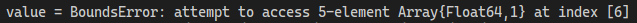

+ 其他操作

```@example intro
# push!: 從陣列後面加入新的值， push!(x, 9.0)
# append!: 串接兩個陣列, y = [10.0, 3.4]; append!(x, y)
# pop!: 從陣列最後移出一個元素, pop!(x)
```

---

## 基礎語法與概念 - 集合容器 (2/4)

#### 集合 (Set) (1/4)
> 如同數學中的集合一樣，不允許重複的元素，每個元素都是唯一的，且元素間也沒有次序

```@example intro
# 把一個陣列放入Set()中來建構一個集合
x = Set([1, 2, 3, 4])
# 增加集合中的元素
push!(x, 5)
```

---

## 基礎語法與概念 - 集合容器 (2/4)

#### 集合 (Set) (2/4)
+ 判斷集合間的關係

```@example intro
y = Set([1, 3, 5])
issubset(y, x) #確認y是否為x的子集, 或輸入 y ⊆ x, 也可得到相同結果
```

+ 交集

```@example intro
intersect(x, y) # 或使用 x ∩ y
```

---

## 基礎語法與概念 - 集合容器 (2/4)

#### 集合 (Set) (3/4)

+ 聯集

```@example intro
union(x, y) # 或使用 x ∪ y
```

差集

```@example intro
setdiff(x, y)
```

---

## 基礎語法與概念 - 集合容器 (2/4)

#### 集合 (Set) (4/4)

+ 判斷集合是否相等

```@example intro
x == Set([3, 1, 2, 5, 4])
```

+ 迭代

```@example intro
for i in x
    println(i)
end
```

---

## 基礎語法與概念 - 集合容器 (3/4)

#### 字串 (Strings) (1/4)
> 一個__字串__可以視為多個__字元 (characters)__的序列組合，但這個組合內容不可變 (immutable)。
+ 字元用__單__引號夾住

```@example intro
typeof('A')
```

+ 見其ASCII編碼

```@example intro
'A'
```

+ 字串用__雙__引號夾住

```@example intro
typeof("A")
```

---

## 基礎語法與概念 - 集合容器 (3/4)

#### 字串 (Strings) (2/4)
+ 字元有其對應的整數

```@example intro
Int('A')
```

+ 字元也可以進行加減法運算

```@example intro
'A' + 1
```

+ 字元也可以比大小

```@example intro
'A' > 'a'
```

---

## 基礎語法與概念 - 集合容器 (3/4)

#### 字串 (Strings) (3/4)
> 字串具有不可變的特性，因此一旦字串被創造出來，就不能被修改，既不能變長也不能變短。因此對其進行的任何操作，實際上是會產出新的字串。

```@example intro
x = "Hello world!"
```

> 也可以用3個雙引號刮起來，就可使用多行字串

```@example intro
"""
Hello
world
!
"""
```

---

## 基礎語法與概念 - 集合容器 (3/4)

#### 字串 (Strings) (4/4)

+ 字串的串接

```@example intro
# 使用 * 將多個字串串接起來
x="1 + "
x * "2 = " * "3"
```

+ 字串的內插

```@example intro
x = "Today"
y = "Sunday"
string(x, "is", y)
```

---

## 基礎語法與概念 - 集合容器 (4/4)

#### 字典 (Dictionary) (1/3)
+ 所謂__字典__是由一組鍵vs.值 (key vs. value) 對應關係所組成的資料結構。鍵必須是唯一的、不能重複，但值可以重複出現。

```@example intro
x = Dict("A" => 1, "B" => 2, "C" => 3)
# 透過鍵這個索引來取得值, 輸入x["A"]可以得到1
```

+ 要是給的鍵不存在，就會發生錯誤
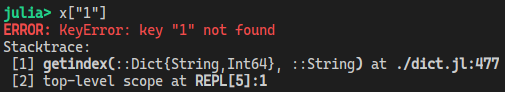

---

## 基礎語法與概念 - 集合容器 (4/4)

#### 字典 (Dictionary) (2/3)

+ 增加新的鍵-值對

```@example intro
x["D"] = 4
x
```

+ 複寫

```@example intro
x["A"] = 5
x
```

---

## 基礎語法與概念 - 集合容器 (4/4)

#### 字典 (Dictionary) (3/3)

+ 迭代

```@example intro
for (k, v) in x
    println(k, "->", v)
end
```

---

## 學完基礎語法之後 -- 進階

+ 型別 (Types)
  - 複合型別, 參數化型別, 抽象型別等
+ 巨集 (Macro)
  - metaprogramming
+ 方法 (Methods)
  - 多重分派
  - 參數化方法
  - 泛型

---

## 學完基礎語法之後 -- 實做

+ 加入Julia Language Study Group並完成其作業
+ 上線上課 (Udemy等)，寫作業
+ 參與別人的研究，透過協助他人分析資料來練功
+ 拿Paper所提供的資料重複跑一次分析

---

# Acknowledgement
+ Taipei Bioinformatics Omnibus

+ 杜岳華


---

*This page was generated using [Literate.jl](https://github.com/fredrikekre/Literate.jl).*

